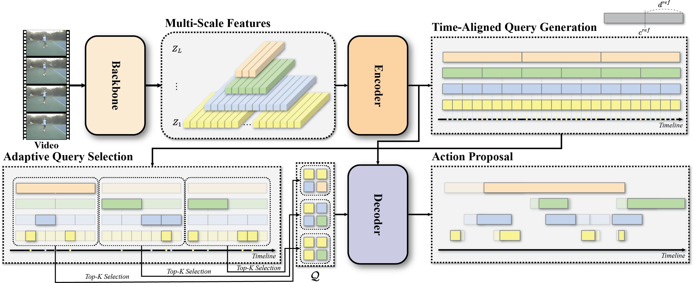

# TE-TAD: Towards Fully End-to-End Temporal Action Detection via Time-Aligned Coordinate Expression

This repository contains the official implementation of the paper TE-TAD: Towards Fully End-to-End Temporal Action Detection via Time-Aligned Coordinate Expression.



Several comments are remained.


# Getting Started

## Installation
```bash
cd util
python setup.py # build NMS
cd ..
```

## Prepare Dataset
We follow [ActionFormer](https://github.com/happyharrycn/actionformer_release) repository for preparing datasets including THUMOS14, ActivityNet v1.3, and EpicKitchens.

Use `scripts/make_feature_info.py` to generate feature information for each dataset.


<!-- ### THUMOS14 -->


## Training
To train the TE-TAD model on the THUMOS14 dataset, execute the following command:
```bash
python main.py --c configs/thumos14.yaml --output_dir logs/thumos14
```
## Evaluation
To evaluate the trained model and obtain performance metrics, use the following command structure:
```bash
python main.py --eval --c configs/thumos14.yaml --output_dir logs/thumos14
```


## Citation
if you find our work helpful, please consider citing our paper:
```
@inproceedings{kim2024te-tad,
      title={TE-TAD: Towards Fully End-to-End Temporal Action Detection via Time-Aligned Coordinate Expression}, 
      author={Kim, Ho-Joong and Hong, Jung-Ho and Heejo, Kong and Lee, Seong-Whan },
      booktitle={Proceedings of the IEEE/CVF Conference on Computer Vision and Pattern Recognition},
      year={2024},
}
```